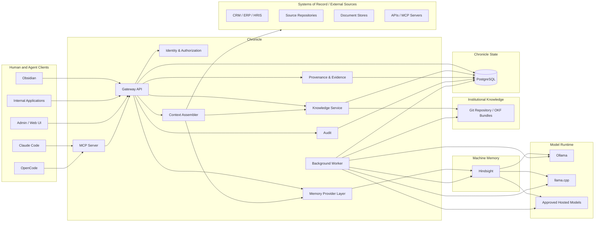
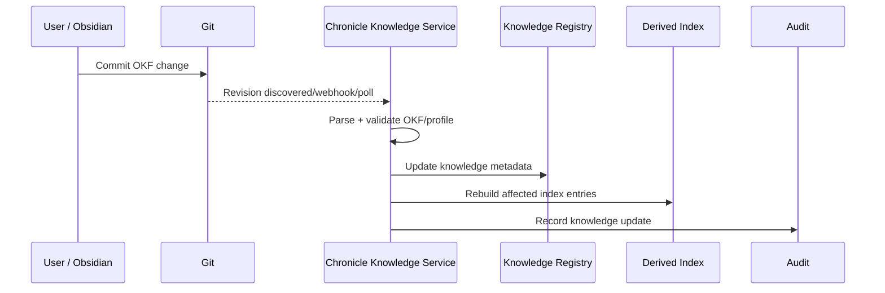
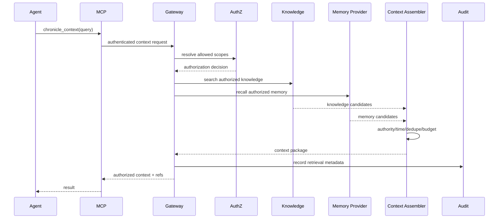
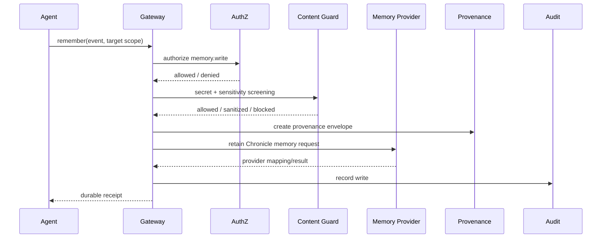
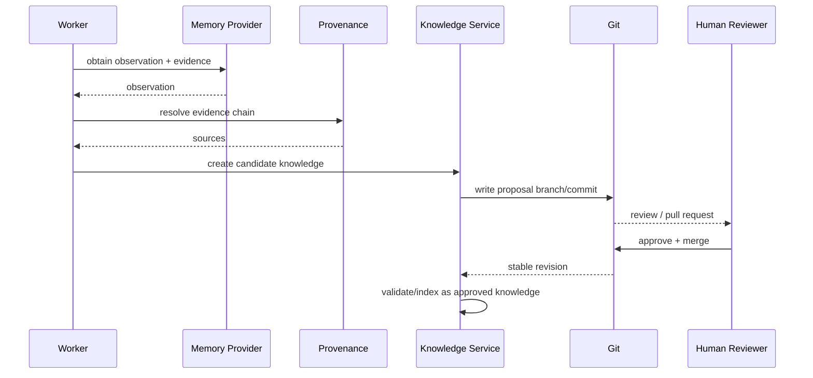
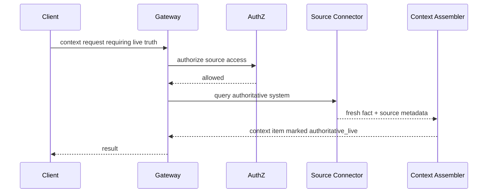
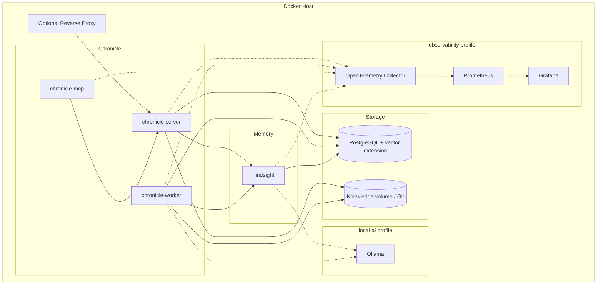
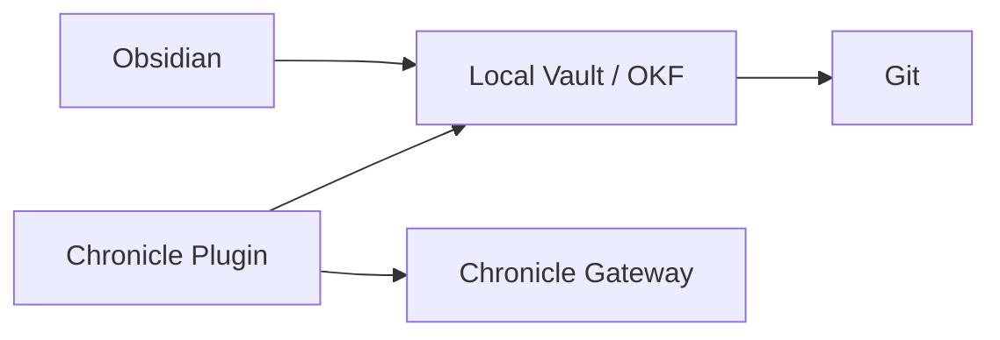
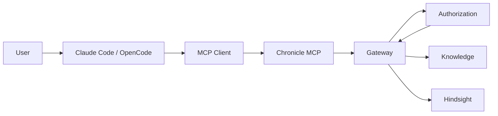

# Chronicle Reference Architecture

**Project:** Chronicle
**Document:** Reference Architecture
**Version:** 0.1-draft
**Status:** Draft for implementation
**Date:** 2026-09-11
**Steward:** Arios Technologies

---

## 1. Purpose

This document turns Chronicle's Project Charter and Technical Specification into an implementable system architecture.

It describes:

- the main runtime components;
- trust boundaries;
- data ownership;
- request and write paths;
- the relationship between machine memory and institutional knowledge;
- the initial Hindsight integration;
- the OKF/Git knowledge plane;
- MCP and human-client integration;
- local-model support;
- the default Docker topology;
- deployment profiles;
- failure boundaries;
- the areas that should remain replaceable.

This is a reference architecture, not a mandate to split Chronicle into many independently deployed microservices.

The first implementation should keep the number of moving parts low. Logical boundaries matter now; physical separation can happen later when scale, security, or operational evidence justifies it.

---

## 2. Architectural stance

Chronicle is a governed context platform with three distinct sources of useful information:

1. **machine memory** — experience retained through a memory provider;
2. **institutional knowledge** — human-readable OKF content stored in Git;
3. **live sources** — systems that remain authoritative for operational truth.

Chronicle's job is to decide what a caller is allowed to see, retrieve the right material, preserve provenance, and assemble enough context to help without quietly turning machine-generated state into organizational truth.

The architecture therefore centers on a trusted Chronicle boundary rather than on the memory engine itself.

---

## 3. High-level system view



---

## 4. Architectural principles

The following principles should guide implementation decisions.

### 4.1 Chronicle owns the trust boundary

Clients should not talk directly to Hindsight, PostgreSQL, or internal knowledge indexes.

Chronicle must remain the point where:

- identity is resolved;
- permissions are checked;
- scopes are calculated;
- provider calls are constrained;
- provenance is attached;
- retrieval is filtered;
- audit events are emitted.

### 4.2 Providers are implementation details

Hindsight is the first memory provider, but its concepts should not become Chronicle's public protocol accidentally.

A future provider should be swappable without forcing:

- Obsidian changes;
- MCP changes;
- agent prompt changes;
- OKF migrations;
- client API rewrites.

### 4.3 Canonical knowledge stays human-readable

The institutional knowledge layer is Git + OKF Markdown.

Search indexes, embeddings, and graphs derived from that knowledge can be rebuilt.

### 4.4 Live truth stays live

Fast-changing operational state should be queried from its authoritative source.

Chronicle can remember the context around that state, not pretend an old copy is current.

### 4.5 Logical separation before physical separation

The first release should not create a network hop for every concept.

A single Chronicle image may host multiple roles while preserving clean internal module boundaries.

---

## 5. Runtime components

### 5.1 Chronicle Gateway

The Gateway is the main public API and trusted policy boundary.

Responsibilities:

- request authentication;
- principal resolution;
- delegated-agent identity resolution;
- authorization;
- scope calculation;
- request validation;
- rate and resource controls;
- routing to knowledge and memory services;
- context requests;
- provider selection;
- provenance packaging;
- correlation IDs;
- audit emission.

The Gateway should not contain model-specific memory logic.

It should orchestrate components that do.

#### Initial deployment

The Gateway should run inside the `chronicle-server` role.

---

### 5.2 Identity adapter

Chronicle should not build a new identity provider.

The identity adapter translates upstream authentication into Chronicle principals.

Supported patterns should eventually include:

- OIDC;
- OAuth 2.x resource-server integration;
- trusted reverse-proxy identity;
- local development identity;
- service/workload credentials.

The identity adapter produces a stable internal principal object.

Example:

```json
{
  "principal_id": "principal:user:01J...",
  "kind": "user",
  "issuer": "https://id.example.org",
  "subject": "248289761001",
  "organization_id": "org:example",
  "claims": {
    "email": "user@example.org"
  }
}
```

Chronicle should store only the upstream claims it actually needs.

---

### 5.3 Authorization service

Authorization answers questions such as:

```text
Can principal X read resource Y?
Can agent A write memory into project P?
Can user U approve knowledge in team T?
Can workload W call provider operation R?
```

This service should support relationship-aware policy rather than relying only on flat roles.

The architecture should keep the policy engine replaceable.

Possible implementations may include an embedded policy layer initially and an external ReBAC/ABAC engine later.

The Reference Architecture does not choose the authorization product yet.

#### Important rule

The authorization service returns decisions. It should not fetch memory content.

That separation reduces accidental disclosure.

---

### 5.4 Scope resolver

The scope resolver calculates the set of memory and knowledge scopes relevant to a request.

Inputs may include:

- principal;
- acting agent;
- organization;
- team;
- project;
- application;
- session;
- resource referenced by the request.

Outputs are explicit authorized scope identifiers.

Example:

```json
{
  "read_scopes": [
    "org:example",
    "team:platform",
    "project:chronicle",
    "user:123"
  ],
  "write_scopes": [
    "project:chronicle",
    "user:123"
  ]
}
```

The resolver must not infer broader access from naming conventions alone.

---

### 5.5 Memory Provider Layer

The provider layer converts Chronicle memory operations into provider-native operations.

The initial adapter is Hindsight.

Conceptual interface:

```typescript
interface MemoryProvider {
  capabilities(): Promise<ProviderCapabilities>

  retain(input: RetainRequest): Promise<RetainResult>

  recall(input: RecallRequest): Promise<RecallResult>

  get(input: GetMemoryRequest): Promise<MemoryRecord | null>

  correct(input: CorrectMemoryRequest): Promise<CorrectionResult>

  forget(input: ForgetMemoryRequest): Promise<ForgetResult>

  reflect?(input: ReflectRequest): Promise<ReflectResult>

  timeline?(input: TimelineRequest): Promise<TimelineResult>

  health(): Promise<ProviderHealth>
}
```

Chronicle's model is canonical at this boundary.

Provider data is translated in and out.

---

### 5.6 Hindsight adapter

The Hindsight adapter is responsible for:

- mapping Chronicle scopes to Hindsight banks/tags/namespaces;
- translating retain requests;
- translating recall results;
- preserving provider identifiers privately;
- requesting observations/reflection;
- propagating deletion where supported;
- reporting Hindsight capabilities;
- provider health checks;
- handling version compatibility.

#### Hard-boundary mapping

The initial implementation should use Hindsight banks as hard isolation units where practical.

Tags and metadata can narrow retrieval within an already-authorized bank.

The exact bank mapping should be defined by ADR after the threat model.

A likely starting point is:

```text
bank = tenant or high-sensitivity boundary
tag  = project/team/user retrieval partition inside the bank
```

This should be tested before production use.

---

### 5.7 Knowledge Service

The Knowledge Service owns Chronicle's interaction with institutional knowledge.

Responsibilities:

- discover OKF bundles;
- parse Markdown/frontmatter;
- validate upstream OKF;
- validate Chronicle profile fields;
- maintain a knowledge registry;
- track Git revision information;
- calculate freshness;
- search authorized knowledge;
- resolve supersession;
- create knowledge proposals;
- process accepted changes;
- trigger derived-index updates.

The Git repository remains canonical.

The Knowledge Service does not become a second document store.

---

### 5.8 Git adapter

The Git adapter abstracts Git operations needed by Chronicle.

Initial operations:

```text
status
read
list
commit metadata
branch
create proposal branch
write candidate file
create commit
diff
resolve current revision
```

Hosted-provider operations such as creating a GitHub or GitLab pull request should be separate adapters.

That separation allows local Git to work without a forge.

---

### 5.9 OKF engine

The OKF engine handles:

- frontmatter parsing;
- OKF v0.2 validation;
- unknown-field preservation;
- Chronicle extension validation;
- links and citations;
- status/freshness metadata;
- normalized document metadata.

Chronicle-specific fields should live below a namespaced `chronicle` section.

The engine should never silently rewrite valid upstream fields into Chronicle-specific equivalents.

---

### 5.10 Knowledge registry

The Knowledge Registry is Chronicle's transactional index of canonical Git knowledge.

It should store metadata such as:

```text
knowledge ID
bundle/repository ID
path
Git commit
content hash
type
title
status
scope
authority
classification
validity
owners
freshness
index state
```

It should not store the Git repository as opaque blobs unless required for caching.

The registry is rebuildable from Git plus Chronicle configuration.

---

### 5.11 Context Assembler

The Context Assembler converts multiple authorized sources into one bounded context response.

Inputs:

- principal;
- agent/workload;
- task/query;
- target scope;
- token/size budget;
- source preferences;
- freshness requirements.

Candidate inputs:

- approved OKF knowledge;
- Hindsight memory;
- live system-of-record data;
- recent task context;
- policy context.

The assembler should:

1. reject unauthorized candidates;
2. remove stale material when current truth is required;
3. prefer higher-authority material;
4. account for temporal validity;
5. avoid duplicates;
6. balance source diversity;
7. fit the configured budget;
8. preserve provenance references.

It should return a structured context package rather than only a concatenated prompt string.

Example:

```json
{
  "context_id": "ctx_...",
  "items": [
    {
      "kind": "knowledge",
      "id": "decision:architecture:0003",
      "content": "...",
      "authority": "approved_decision",
      "source_ref": "evidence:..."
    },
    {
      "kind": "memory",
      "id": "memory:...",
      "content": "...",
      "authority": "verified_memory",
      "source_ref": "evidence:..."
    }
  ],
  "budget": {
    "requested_tokens": 6000,
    "estimated_tokens": 4210
  }
}
```

---

### 5.12 Provenance and Evidence Service

The Evidence Service maintains the relationship between:

- source;
- memory;
- observation;
- proposal;
- knowledge.

It should provide an API that lets clients traverse backward from a result to its basis.

Example:

```text
approved runbook
  ← Git commit
  ← knowledge proposal
  ← Hindsight observation
  ← memory facts
  ← incident records
```

This service is one of Chronicle's core differentiators.

---

### 5.13 Audit service

Audit records security-relevant events without copying sensitive content unnecessarily.

The Audit service should support:

- append-only event creation;
- query by actor;
- query by resource;
- query by correlation ID;
- export to external SIEM/log systems.

A later implementation may send audit events to an external append-only store.

The initial implementation can keep a durable audit table in PostgreSQL with external export hooks.

---

### 5.14 Background worker

A worker handles tasks that should not block interactive requests.

Likely tasks:

- memory extraction/enrichment;
- Hindsight reflection;
- observation synchronization;
- OKF re-indexing;
- stale-document checks;
- Git proposal generation;
- entity reconciliation;
- retention;
- deletion propagation;
- re-embedding;
- benchmark jobs.

The first release should use a lightweight job abstraction.

Chronicle should not introduce a distributed workflow platform until workload evidence justifies it.

---

### 5.15 MCP server

The MCP server exposes a deliberately small agent-facing interface.

The MCP server should delegate authorization and business logic to the Gateway rather than reimplementing it.

Candidate tools:

```text
chronicle_context
chronicle_recall
chronicle_remember
chronicle_knowledge_search
chronicle_knowledge_read
chronicle_evidence
chronicle_correct_memory
chronicle_forget_memory
chronicle_propose_knowledge
```

The final set should be tested for overlap.

The safest MCP interface is the smallest one that still lets agents do useful work.

---

### 5.16 Admin UI

The Admin UI is not required for the first functional proof, but the architecture should reserve a place for it.

Likely functions:

- identity/scope inspection;
- policy management;
- memory inspection;
- evidence/provenance viewer;
- proposal queue;
- conflicts/disputes;
- retention policy;
- provider health;
- audit search;
- retrieval diagnostics;
- system configuration.

Obsidian remains the everyday knowledge-worker interface.

The Admin UI is for operating Chronicle.

---

## 6. Data ownership

A central rule is that every class of data has one clear owner.

| Data | Canonical owner | Derived copies allowed? |
|---|---|---|
| Approved institutional knowledge | Git / OKF | Yes |
| Git history | Git | Metadata/indexes |
| Chronicle identity mapping | Chronicle PostgreSQL | Cache |
| Scope/policy state | Chronicle | Cache |
| Machine memory | Memory provider | Chronicle metadata/mapping |
| Provider IDs | Provider adapter mapping | Yes |
| Provenance graph | Chronicle | Search projection |
| Audit metadata | Chronicle | SIEM export |
| Embeddings | Derived index/provider | Rebuildable |
| Search index | Derived | Rebuildable |
| Live CRM/ERP state | Source system | Fresh cache only |
| Obsidian vault view | Git/OKF files | Local working copy |

No derived index should quietly become the only copy of institutional knowledge.

---

## 7. Core data flows

### 7.1 Human-authored knowledge



The Git commit is the canonical change.

Chronicle indexes it; Chronicle does not replace it.

---

### 7.2 Agent recall



---

### 7.3 Machine-memory write



---

### 7.4 Memory-to-knowledge promotion



This is the core lifecycle Chronicle exists to support.

---

### 7.5 Current authoritative query



An old memory may still be included as historical context, but it should not replace the fresh operational fact.

---

## 8. Trust boundaries

Chronicle should explicitly document and test the following boundaries.

### Boundary A — Human client → Chronicle

Risk:

- stolen credentials;
- malicious input;
- over-broad user access.

Controls:

- authentication;
- authorization;
- request validation;
- audit.

### Boundary B — Agent → Chronicle

Risk:

- compromised agent;
- prompt injection;
- autonomous overreach;
- unsafe memory writes.

Controls:

- separate agent identity;
- delegated permissions;
- tool-level authorization;
- confirmation policies;
- write-scope limits.

### Boundary C — Chronicle → Hindsight

Risk:

- provider leakage;
- provider bug;
- provider prompt injection;
- bad bank mapping.

Controls:

- provider isolation;
- scoped calls;
- adapter validation;
- provider-specific tests;
- no direct client access.

### Boundary D — Chronicle → model endpoint

Risk:

- sensitive context leaves approved boundary;
- untrusted model output;
- model endpoint compromise.

Controls:

- configurable model routing;
- data classification policy;
- local-provider support;
- egress controls;
- output validation.

### Boundary E — Chronicle → Git/OKF

Risk:

- unauthorized knowledge changes;
- malicious Markdown;
- secrets committed permanently.

Controls:

- Git authorization;
- validation;
- secret scanning;
- promotion workflow;
- content hashing.

### Boundary F — Chronicle → system of record

Risk:

- privilege escalation;
- source ACL mismatch;
- stale cached state.

Controls:

- source-scoped credentials;
- ACL propagation;
- freshness rules;
- explicit authority markers.

### Boundary G — external source → Chronicle

Risk:

- indirect prompt injection;
- false assertions;
- poisoning;
- malformed data.

Controls:

- source classification;
- untrusted-source labeling;
- sanitization;
- authority limits;
- evidence retention.

---

## 9. Default deployment topology

The first supported deployment should work on one machine using Docker Compose.



---

## 10. Compose services

### 10.1 `chronicle-server`

Contains:

- Gateway;
- REST API;
- identity adapter hooks;
- authorization module;
- scope resolver;
- Knowledge Service API;
- Context Assembler;
- provider registry;
- evidence API;
- audit API;
- health/readiness endpoints.

### 10.2 `chronicle-worker`

Uses the same Chronicle image where practical.

Runs:

- async job processor;
- knowledge indexing;
- provider reflection/synchronization;
- knowledge proposal jobs;
- retention jobs;
- Git synchronization jobs.

### 10.3 `chronicle-mcp`

May use the same image with an MCP command.

It should call the server over the internal API rather than directly connecting to databases/providers.

### 10.4 `hindsight`

Official pinned Hindsight container.

It remains a separate service.

### 10.5 `postgres`

One PostgreSQL server can initially host:

```text
chronicle database
hindsight database
```

The databases remain logically separate.

### 10.6 knowledge volume

The default quickstart should mount a host directory such as:

```text
./data/knowledge
```

Chronicle initializes it as a Git repository/OKF bundle when required.

This keeps the user's institutional knowledge directly accessible.

---

## 11. Compose profiles

### Core

Default:

```bash
docker compose up -d
```

Starts:

```text
chronicle-server
chronicle-worker
chronicle-mcp
hindsight
postgres
```

### `local-ai`

```bash
docker compose --profile local-ai up -d
```

Adds a supported local model server such as Ollama.

Large model downloads should require explicit user intent.

### `observability`

Adds:

- OpenTelemetry Collector;
- Prometheus;
- Grafana or another compatible dashboard layer.

### `collaboration`

May eventually add a local Git forge such as Forgejo, or supporting services needed for collaborative Git review.

This should not be required for the local quickstart.

### `development`

May add:

- mail/testing services;
- dev database tooling;
- mock identity;
- debugging helpers.

---

## 12. Chronicle image strategy

Chronicle should aim for one first-party runtime image initially.

Example:

```text
ghcr.io/ariostech/chronicle:<version>
```

Commands:

```text
chronicle server
chronicle worker
chronicle mcp
chronicle migrate
chronicle doctor
chronicle init
```

Benefits:

- one image to patch;
- one SBOM;
- consistent runtime;
- fewer version-skew problems.

If later scale or security evidence justifies separate images, the project can split them.

---

## 13. Bootstrap flow

A first-run bootstrap should be automated.

Conceptual flow:

```text
1. PostgreSQL becomes ready.
2. Chronicle migrations run.
3. Hindsight becomes ready.
4. Chronicle validates Hindsight compatibility.
5. Chronicle initializes the configured knowledge directory.
6. Chronicle creates Git metadata if needed.
7. Chronicle validates or creates the first OKF bundle.
8. Chronicle creates required provider banks/namespaces.
9. Chronicle verifies model/provider connectivity.
10. Chronicle exposes setup-required state.
11. Initial administrator/bootstrap identity is configured.
12. Health checks transition to ready.
```

The user should not need to execute container-internal commands during a normal quickstart.

---

## 14. Quickstart target

The README should eventually support a flow close to:

```bash
git clone https://github.com/ariostech/chronicle.git
cd chronicle
cp .env.example .env
docker compose up -d
```

Then:

```text
http://localhost:<port>
```

The setup path should ask only for information Chronicle cannot safely infer.

Examples:

- organization name;
- local vs external model;
- identity configuration;
- initial knowledge path;
- first admin.

---

## 15. Network policy

Chronicle should assume that internal Docker networking alone is not an authorization mechanism.

Recommended internal exposure:

| Service | Host exposure |
|---|---|
| chronicle-server | Yes |
| chronicle-mcp | Optional, depending on transport |
| hindsight | No by default |
| postgres | No by default |
| ollama | No by default unless explicitly needed |
| telemetry | Controlled |
| grafana | Optional |

The server is the intended entry point.

---

## 16. Model architecture

Chronicle should not require one global model configuration.

Model tasks differ.

Potential task classes:

```text
embedding
memory extraction
classification
entity extraction
summarization
reflection
reranking
knowledge drafting
```

A model-routing configuration should eventually map task class to model endpoint.

Example:

```yaml
models:
  embedding:
    provider: ollama
    model: example-embed

  extraction:
    provider: ollama
    model: example-small

  reflection:
    provider: openai-compatible
    model: stronger-model
```

Hindsight may have its own provider configuration initially.

Chronicle should avoid duplicating provider-internal model choices unless Chronicle needs control over them.

---

## 17. Local-model path

The local path should support:

```text
Ollama
llama.cpp
OpenAI-compatible local servers
```

The system must not assume cloud egress.

Organizations should be able to classify certain workloads as:

```text
local-only
approved-remote
any-approved-provider
```

This becomes relevant when memory contains confidential material.

---

## 18. Obsidian architecture

Obsidian interacts with both the filesystem and Chronicle.



Normal note editing should not require the server.

Chronicle-enhanced operations may include:

- related memory;
- evidence;
- organizational search;
- propose knowledge;
- show lifecycle state;
- show superseded items;
- ask Chronicle.

The plugin must preserve offline readability.

---

## 19. Coding-agent architecture

A coding agent should never receive a general-purpose credential to the entire Chronicle deployment.

Example:



Effective identity should preserve:

```text
user
agent
application
project/repository context
```

That lets policy distinguish:

```text
Oshane may read Finance.
Claude Code acting for Oshane on Repository X may not.
```

---

## 20. Knowledge indexing

Chronicle should initially use the simplest index that meets the benchmark.

A likely progression:

### Phase 1

- PostgreSQL metadata;
- full-text search;
- embeddings if needed.

### Phase 2

Add graph/entity indexing if benchmarks show clear benefit.

### Phase 3

Evaluate HelixDB or another graph/vector engine if the workload justifies it.

The architecture intentionally avoids making HelixDB a day-one dependency.

---

## 21. Event and job architecture

The initial worker can use a PostgreSQL-backed job table or similarly small queue abstraction.

Required properties:

- durable jobs;
- retry policy;
- idempotency;
- dead-letter/failure state;
- correlation IDs;
- observable status.

Chronicle should not adopt Kafka, Temporal, NATS, or another distributed platform until actual workload requirements justify it.

The job API should make such migration possible later.

---

## 22. Database boundaries

Chronicle-owned PostgreSQL state should not depend on Hindsight's schema.

Recommended logical databases:

```text
chronicle
hindsight
```

Chronicle stores only its own provider mapping:

```text
chronicle_memory_id
provider_name
provider_memory_id
provider_namespace
created_at
```

Provider schema upgrades then remain isolated.

---

## 23. Suggested Chronicle database domains

The Chronicle database is likely to contain tables/modules around:

```text
identity
scope
membership
authorization mapping
resources
provider mapping
knowledge registry
evidence
provenance
retention
audit
jobs
configuration metadata
```

The exact schema should be designed after the security model and language/framework decisions.

---

## 24. Knowledge bundle boundaries

A small team may use one bundle.

A larger organization may use several.

Example:

```text
company-common
engineering
finance
project-alpha
project-beta
```

The architecture should support mounting multiple authorized bundles into one user experience.

Chronicle should not force all institutional knowledge into one repository.

This is important because Git history itself is difficult to secure at file-level granularity once cloned.

---

## 25. Search federation

The Context Assembler should federate retrieval over the caller's authorized sources.

Pseudo-flow:

```text
authorized_bundles = auth.knowledge_bundles(caller)
authorized_memory = auth.memory_scopes(caller)
authorized_live_sources = auth.live_sources(caller)

knowledge_candidates = search(authorized_bundles)
memory_candidates = recall(authorized_memory)
live_candidates = query_if_needed(authorized_live_sources)

return assemble(
    knowledge_candidates,
    memory_candidates,
    live_candidates
)
```

Authorization happens before broad retrieval wherever the backing system permits it.

---

## 26. Provenance graph

Chronicle's provenance graph need not begin as a graph database.

It can initially be represented relationally.

Conceptual relationships:

```text
SOURCE
  supports
MEMORY

MEMORY
  contributes_to
OBSERVATION

OBSERVATION
  supports
KNOWLEDGE_PROPOSAL

KNOWLEDGE_PROPOSAL
  becomes
KNOWLEDGE_REVISION

KNOWLEDGE_REVISION
  supersedes
KNOWLEDGE_REVISION
```

The public API should expose relationships independently of storage choice.

This preserves the option to move to a graph engine later.

---

## 27. Failure isolation

Chronicle should degrade in understandable ways.

### Hindsight unavailable

Still available:

- approved OKF knowledge;
- Git editing;
- knowledge search if index remains healthy;
- administrative functions not dependent on memory.

Unavailable:

- machine-memory recall/write;
- memory-derived promotion.

### Git unavailable

Still available:

- existing indexed knowledge in read-only/degraded mode if policy permits;
- machine memory;
- provider operations.

Unavailable:

- canonical knowledge writes;
- proposal merges;
- guaranteed freshness.

### Model unavailable

Still available:

- deterministic search;
- existing memory retrieval where provider permits;
- approved knowledge browsing;
- admin/audit.

Unavailable:

- model-dependent extraction/reflection/drafting.

### PostgreSQL unavailable

Chronicle should fail closed for protected operations rather than bypass policy or identity state.

---

## 28. Readiness and health

Each service should expose:

```text
liveness
readiness
dependency health
version
build revision
```

Chronicle's `/ready` should only return success when the dependencies required for its configured mode are available.

Optional dependencies should be reported separately rather than making the whole service unhealthy.

---

## 29. Version compatibility

Chronicle should maintain a compatibility matrix for:

```text
Chronicle version
Hindsight version
PostgreSQL version
OKF version
MCP protocol revision
Obsidian plugin version
```

A `chronicle doctor` command should eventually validate the running stack.

---

## 30. Security architecture requirements

The Reference Architecture assumes the following controls will be defined in the threat model:

- authenticated requests at the trusted boundary;
- resource-aware authorization;
- delegated-agent identity;
- secret scanning before durable memory;
- prompt-injection-aware source handling;
- provider isolation;
- source ACL preservation;
- audit trails;
- encryption in transit where deployment crosses hosts;
- safe cookie/token handling;
- least-privilege database users;
- read-only mounts where appropriate;
- controlled egress to model providers;
- dependency and image scanning.

No production deployment should expose Hindsight or PostgreSQL directly to untrusted clients.

---

## 31. Secrets

The default Compose stack should support `.env` for local evaluation, but production documentation should recommend stronger secret sources.

Potential production mechanisms:

```text
Docker secrets
Kubernetes secrets/external secret managers
mounted secret files
platform secret stores
```

Secrets must not be stored in OKF knowledge or machine memory.

---

## 32. Backup architecture

Backups should treat canonical and derived state differently.

### Must back up

```text
Chronicle PostgreSQL
Hindsight persistence
Git/OKF repositories
deployment configuration needed for recovery
```

### Can rebuild

```text
full-text indexes
embeddings
derived graph projections
caches
temporary context
```

The project should provide documented restore order.

Likely order:

```text
Git/OKF
PostgreSQL
Hindsight
Chronicle migrations
derived-index rebuild
health verification
```

---

## 33. Development environment

The repository should make local development close to production topology without making every code change require rebuilding every container.

A likely development mode:

```text
PostgreSQL in Docker
Hindsight in Docker
optional Ollama in Docker or host
Chronicle server on host with hot reload
Chronicle worker on host
MCP on host
knowledge directory mounted locally
```

The `development` profile can provide dependencies while application processes run from the developer's toolchain.

---

## 34. Repository architecture

The initial monorepo should reflect logical ownership.

Recommended structure:

```text
chronicle/
├── apps/
│   ├── server/
│   ├── admin/
│   └── docs/
│
├── packages/
│   ├── protocol/
│   ├── auth/
│   ├── context/
│   ├── knowledge-okf/
│   ├── provenance/
│   ├── mcp/
│   ├── sdk-typescript/
│   ├── sdk-python/
│   └── benchmark/
│
├── providers/
│   └── hindsight/
│
├── integrations/
│   ├── obsidian/
│   ├── claude-code/
│   └── opencode/
│
├── deploy/
│   ├── compose/
│   └── docker/
│
├── docs/
│   ├── project/
│   ├── spec/
│   ├── architecture/
│   ├── security/
│   ├── adr/
│   └── rfc/
│
├── examples/
└── tests/
```

This does not require all directories to exist on day one.

---

## 35. Initial physical deployment recommendation

For the first proof of concept:

```text
1 Chronicle runtime image
1 Hindsight image
1 PostgreSQL image
optional Ollama image
host-mounted Git/OKF directory
```

Chronicle runtime roles:

```text
server
worker
mcp
```

This is enough to validate the architecture without introducing infrastructure unrelated to the core memory problem.

---

## 36. Scale path

Chronicle should be able to scale gradually.

### Stage 1 — Single host

Docker Compose.

### Stage 2 — Larger single organization

Separate server/worker replicas, managed PostgreSQL, external Git provider, centralized identity.

### Stage 3 — High availability

Container orchestrator, replicated application layer, HA PostgreSQL, durable queue, provider scaling.

### Stage 4 — Federation / regional deployment

Only after Chronicle has explicit semantics for:

- trust;
- source provenance;
- tenant boundaries;
- replicated scope;
- revocation;
- residency.

Federation should not be designed implicitly through shared database access.

---

## 37. What Chronicle deliberately does not centralize

Chronicle should not become the execution environment for every tool.

It should integrate with:

- MCP servers;
- agent runtimes;
- workflow engines;
- source systems.

It should not absorb them all.

Similarly, Chronicle should not become:

- a Git forge;
- an identity provider;
- an LLM server;
- a vector database;
- an agent framework.

The default Compose stack may include optional dependencies for convenience, but the architecture should preserve these boundaries.

---

## 38. Architecture decision sequence

The next ADRs should likely address:

```text
ADR-0001 License choice
ADR-0002 Primary implementation language and web framework
ADR-0003 Hindsight provider boundary
ADR-0004 PostgreSQL ownership and database separation
ADR-0005 Initial authorization model/engine
ADR-0006 OKF v0.2 Chronicle profile
ADR-0007 Knowledge bundle boundary strategy
ADR-0008 Initial async job mechanism
ADR-0009 MCP transport/authentication
ADR-0010 Initial local model profile
```

The threat model should be completed before finalizing ADRs 0005, 0007, and 0009.

---

## 39. Proof-of-concept build order

The architecture suggests this implementation order:

### Step 1 — Repository and runtime skeleton

Create:

```text
server
worker
mcp
provider-hindsight
knowledge-okf
PostgreSQL migration framework
Compose stack
```

No advanced UI yet.

### Step 2 — Identity and scopes

Implement a minimal authenticated principal and project/user scope model.

Use simple development identity only behind an explicit development mode.

### Step 3 — Hindsight provider

Implement:

```text
health
retain
recall
provider mapping
```

### Step 4 — OKF knowledge

Implement:

```text
bundle discovery
parse
validate
registry
basic search
Git revision tracking
```

### Step 5 — Context assembler

Fuse authorized knowledge + Hindsight recall.

### Step 6 — MCP

Expose the smallest useful tool set to Claude Code/OpenCode.

### Step 7 — Promotion loop

Create candidate knowledge from memory, commit it to a branch, and support human review.

### Step 8 — Obsidian integration

Add Chronicle-enhanced features over the same Git/OKF bundle.

### Step 9 — security hardening

Apply the threat model, adversarial tests, secret scanning, authorization enforcement, and audit.

### Step 10 — benchmark

Run the executable benchmark against the full loop.

---

## 40. MVP architecture test

The first architecture milestone should be considered successful when all of the following happen on a clean machine:

```text
docker compose up
      ↓
Chronicle initializes
      ↓
Hindsight becomes healthy
      ↓
OKF bundle is available
      ↓
user authenticates
      ↓
Claude Code/OpenCode connects through MCP
      ↓
agent retrieves approved OKF knowledge
      ↓
agent writes project-scoped memory
      ↓
memory is recalled in a later fresh session
      ↓
observation becomes candidate knowledge
      ↓
candidate is committed as OKF
      ↓
human approves/merges it
      ↓
future agent retrieves approved knowledge
      ↓
Chronicle can trace it back to evidence
```

If this requires manual database editing or direct calls to Hindsight, the architecture is not yet implemented correctly.

---

## 41. Architecture risks to validate early

The following are the highest-risk assumptions in the current design.

### 41.1 Hindsight bank mapping

We need to prove that Chronicle can impose the required scope/security model without leaking across banks or depending on weak metadata filters.

### 41.2 Knowledge bundle boundaries

Git's clone/history semantics mean repository boundaries may need to align with security boundaries more often than ordinary wiki designs assume.

### 41.3 Promotion quality

Automatically drafted institutional knowledge can become noisy or dangerously confident.

The review path must remain useful rather than turning into PR spam.

### 41.4 Retrieval fusion

Combining machine memory, approved knowledge, and live sources can produce contradictions.

Authority, time, and provenance must be applied consistently.

### 41.5 Local-model quality

Smaller local models may be sufficient for extraction but weaker for reflection or knowledge drafting.

Chronicle should measure task-specific quality rather than assume one model is adequate for every memory job.

### 41.6 Operational simplicity

It is easy for this architecture to accumulate too many dependencies.

The default Compose stack is a constraint against that tendency.

---

## 42. Near-term benchmark questions

Before adding another storage engine, benchmark:

- Hindsight recall quality at realistic memory volume;
- temporal correctness;
- contradiction behavior;
- project/team isolation under Chronicle's mapping;
- evidence/provenance completeness;
- local-model extraction quality;
- context assembly quality;
- latency with OKF + memory fusion.

Only after these results should Chronicle decide whether a graph/vector engine such as HelixDB materially improves the system.

---

## 43. Open questions

The Reference Architecture intentionally leaves these unresolved:

- implementation language;
- API framework;
- authorization engine;
- exact principal token format;
- Git hosting adapters;
- initial search engine for OKF;
- queue/job library;
- entity registry design;
- exact Hindsight bank strategy;
- exact Obsidian synchronization behavior;
- remote MCP deployment pattern;
- secrets/DLP implementation;
- admin UI technology;
- model routing implementation.

These decisions should follow from the threat model, proof of concept, and benchmark data.

---

## 44. Next architecture artifact

The next required artifact is the **Chronicle Security and Threat Model**.

It should enumerate:

- protected assets;
- actors;
- trust boundaries;
- attacker capabilities;
- abuse cases;
- memory-specific threats;
- knowledge-promotion threats;
- MCP threats;
- Git/OKF threats;
- provider threats;
- model-endpoint threats;
- mitigations;
- required security tests.

That document should be completed before the implementation locks in the authorization and repository-boundary choices.

---

## 45. Closing architecture rule

Chronicle should have one obvious answer to this question:

> Where is trust decided?

The answer should be:

> At Chronicle's governed boundary, using identity, policy, scope, provenance, authority, and time — not inside the model and not inside the memory provider.

That is the architectural distinction that allows Chronicle to use Hindsight today, replace it tomorrow, serve humans through Obsidian, serve agents through MCP, and still keep institutional knowledge understandable outside the AI stack.
